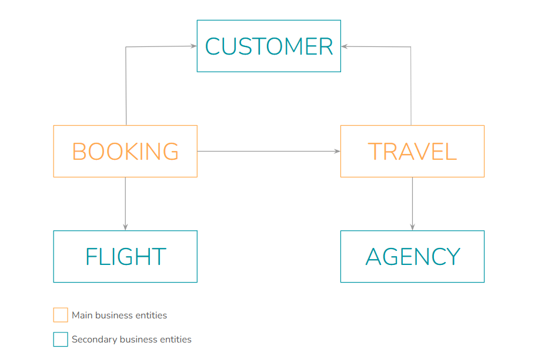
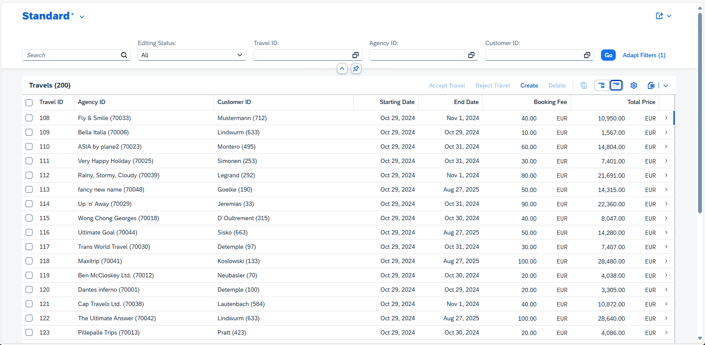
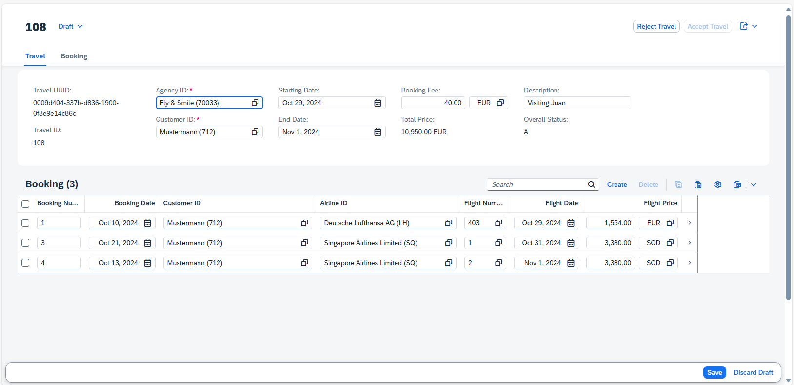

# List Report Travel App
ABAP Project - Greenfield Implementation - of a list report travel app by Yoga Rafinika

## Introduction
This application provides a comprehensive solution for managing travel reports, making it easier to track and report travel-related activities.

## Features
  - **List Reports**: View and manage travel reports in a list format.
  - **Detailed Views**: Access detailed information about each travel report.
  - **Search Functionality**: Quickly find specific travel reports using the search feature.
  - **User-Friendly Interface**: Intuitive and easy-to-navigate user interface.
  - **ABAP Integration**: Leverages the power of ABAP for efficient data processing and reporting.

## Business Scenario
The application follows the ABAP RESTful Application Programming Model (RAP), which includes the following components:

  - Business Object (BO): Defines the data model and business logic.
  - Service Definition: Exposes the BO as a service.
  - Service Binding: Binds the service to a specific protocol (e.g., OData).

Here is the simplified flight data model for this app.

### Travel
A Travel entity defines general travel data, such as the agency ID or customer ID, the status of the travel booking, and the price of travel. The travel data is stored in the database table `ZYR_TRAVEL`.

### Booking
A Booking entity comprises general flight-and booking data as well as the related customer ID and travel ID. The booking data is stored in the database table `ZYR_BOOK`. The flight data model defines a 1:n cardinality between a Travel and the Booking entity.

### Agency
An Agency entity defines travel agency data, such as the address and contact data. The corresponding data is stored in the database table `/DMO/AGENCY`. The flight data model defines a 1:n cardinality between Agency and Travel.

### Flight
A Flight entity defines general flight data for each connection. The flight data is stored in the database table `/DMO/FLIGHT`. The flight data model defines a 1:n cardinality between the Connection and the Flight entity.

### Customer
A Customer entity provides a detailed description of a flight customer (passenger) such as the name, the address, and contact data. The corresponding data is stored in the database table `/DMO/CUSTOMER`. The flight data model defines a 1:n cardinality between Customer and Travel.

## Getting Started
### Prerequisites
  - SAP NetWeaver AS ABAP 7.52 or higher
  - ABAP Development Tools (ADT) in Eclipse
  - SAP BTP ABAP Environment Access (This project use the Trial version) 

### Installation

  1. Clone the repository to your local machine:

  `git clone https://github.com/rafinika/list-report-travel-app.git`

  2. Import the project into your ABAP development environment.

  3. Activate all the objects in the project.

### Fiori App
You can directly interact with the app using the following Fiori app link (Auth. Access Required):

[Fiori App Link](https://23bf02f0-9d4d-4fe7-ae57-cab54ffafb1e.abap-web.us10.hana.ondemand.com/sap/bc/adt/businessservices/odatav4/feap/C%C2%87u%C2%84C%C2%83%C2%84%C2%89C%C2%83xu%C2%88uHC%C2%87u%C2%84C%C2%8E%C2%8D%C2%86s%C2%89%7Ds%C2%86u%C2%84s%C2%88%C2%86u%C2%8Ay%C2%80s%C2%83HC%C2%87%C2%86%C2%8AxC%C2%87u%C2%84C%C2%8E%C2%8D%C2%86s%C2%89%7Ds%C2%86u%C2%84s%C2%88%C2%86u%C2%8Ay%C2%80CDDDEC77h%C2%86u%C2%8Ay%C2%8077sU%7By%C2%82w%C2%8DTTsV%C2%83%C2%83%7F%7D%C2%82%7BTTsW%C2%89%C2%86%C2%86y%C2%82w%C2%8DTTsW%C2%89%C2%87%C2%88%C2%83%C2%81y%C2%8677U%7By%C2%82w%C2%8DTTV%C2%83%C2%83%7F%7D%C2%82%7BTTW%C2%89%C2%86%C2%86y%C2%82w%C2%8DTTW%C2%89%C2%87%C2%88%C2%83%C2%81y%C2%8677nmfsi%5DsfUdshfUjY%6077DDDE77nmfsi%5DsfUdshfUjY%60scH/index.html?sap-ui-xx-viewCache=false&sap-ui-language=EN&sap-client=100 "List Report Travel App")

Screenshot from the Fiori App
- Transactional List Report Travel App

- Draft Enabled App

## Usage
Once the application is installed and deployed, you can start using it by following these steps:

  1. **Access the application**: Open the application through the provided URL or access point within your ABAP environment.
  2. **Navigate through the interface**: Click on the "Go" to show the list of existing data. Use the main menu to switch between different sections of the application.
  3. **Create a new travel report**: Click on the "Create" button and fill in the required details.
  4. **View and manage existing reports**: Use the list view to browse through existing travel reports. Click on any report to view more details.

## Test Cases
### Test Case 1: Create a new Travel Record
  1. **Create a new Travel record**:
    - Navigate to the Travel creation page.
    - Fill in the travel details with inconsistent values for the Agency ID, the Customer ID, and the Begin date and/or the End date.
    - Click on the "Save" button.
    - Verify that the corresponding error messages are shown for the inconsistent values. 
  
  2. **Correct the values and save**:
    - Correct the values for the Agency ID, the Customer ID, and the Begin date and/or the End date.
    - Click on the "Save" button again.
    - Verify that the validations pass successfully.
    - Verify that the determinations were executed, the Travel ID was calculated, and the Booking status was defaulted.
    
### Test Case 2: Verify Instance Specific Feature Control
  1. **Use the actions Accept and Reject**:
    - On the Travel Object Page, use the "Accept" and "Reject" actions to verify the instance specific feature control.

### Test Case 3: Create a New Booking Instance for a Travel
  1. **Create a new booking instance**:
    - On the Travel Object Page, navigate to the Booking table.
    - Click on "Create" to create a new booking instance for the travel.
    - Provide some valid entries for the booking.
    - Click on the "Save" button.
    - Navigate back to the Travel Object Page.
    - Verify that the header instance was not reloaded and the old Total price is shown.

  2. **Manual refresh**:
    - Perform a manual refresh of the UI.
    - Verify that the updated Total Price is shown after the refresh.

### Test Case 4: Delete a Travel Instance
  1. **Delete the Travel instance**:
    - On the Travel Object Page, click on "Delete" to delete the Travel instance.
    - Verify that the Travel instance is deleted successfully.

## Project Structure
src/: Contains the source code for the application.

img/: Contains the source for the images.

## Contributing
Contributions are welcome! Please fork the repository and create a pull request with your changes. 

## License
This project is licensed under the MIT License. See the LICENSE file for more details.

## Contact
If you have any questions, feel free to reach out to [rafinika](https://github.com/rafinika "ABAP Developer").

Feel free to let me know if you need any additional changes or information!

